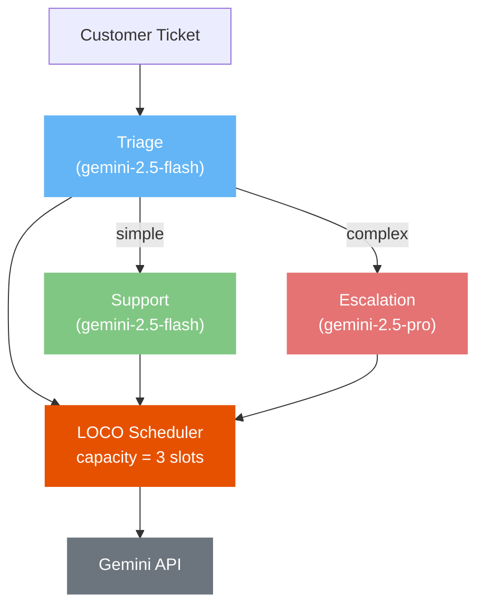

# LOCO-ADK Demo -- Customer Support System

3 Google ADK agents sharing a bounded Gemini API pool, scheduled by [LOCO-Agent](https://github.com/ArielSmoliar/loco-agent).

| Agent | Model | Role | Weight |
|-------|-------|------|--------|
| **triage** | gemini-2.5-flash | Classifies tickets (simple/complex) | 1.0 |
| **support** | gemini-2.5-flash | Responds to simple tickets | 1.0 |
| **escalation** | gemini-2.5-pro | Handles complex issues with deep reasoning | 3.0 |

When all 3 agents spike simultaneously, LOCO decides who gets the API slot next -- escalations get priority, but triage never starves.

## Quick Start (mock mode, no API key needed)

```bash
git clone https://github.com/ArielSmoliar/loco-adk-demo.git
cd loco-adk-demo
python3 -m venv .venv && source .venv/bin/activate
pip install -e .
python run_mock.py
```

Try different capacity settings to see contention:

```bash
python run_mock.py --capacity 1   # heavy contention -- one slot, 8 tickets
python run_mock.py --capacity 10  # no contention -- 10 slots, 8 tickets
```

## Live Mode (with Gemini API)

```bash
cp .env.example .env
# Edit .env and add your GOOGLE_API_KEY from https://aistudio.google.com/apikey
export GOOGLE_API_KEY="your-key"
python run.py
```

## What LOCO Does Here

Without LOCO, all 3 agents hit the Gemini API blindly. Under load:
- Rate limit errors when too many concurrent calls
- Cheap triage calls block expensive escalation calls
- No visibility into which agent is spending how much

With LOCO:
- **Bounded concurrency** -- `capacity=3` means max 3 API calls at once
- **Automatic priority** -- escalation (weight=3) outscores triage (weight=1)
- **No starvation** -- triage still completes, just waits when slots are full
- **Cost tracking** -- `scheduler.metrics.cost_by_agent()` shows per-agent spend

## Architecture


